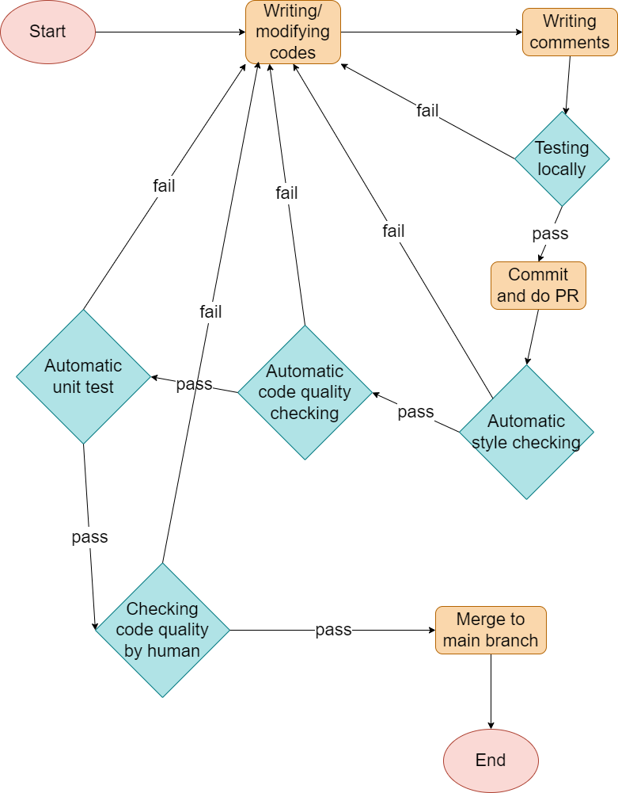

# CI/CD Pipeline Phase 1

- [x] linting and code style enforcement (may happen in pipeline and/or in editor)
- [x] code quality via tool  (ex. Codeclimate, Codacy, etc.)
- [x] code quality via human review (ex. Pull Requests)
- [x] unit tests via automation (ex. Jest, Tape, Ava, Cypress, Mocha/Chai, etc.)*
- [x] documentation generation via automation (ex. JSDocs)

## Currently Functional 

### - Pull Request Title Style Enforcement 
We decided to use `Commitlint` to enforce the Conventional Commit message format (the PR title) for our project's version control system. The decision is documented under [specs/adrs/commitlint.md](../../specs/adrs/commitlint.md). 

### - Linting and Code Style Enforcement
- Locally in editor, run `npm run fix` before commiting any js code file. This is the same as `npm run prettier --write . && eslint --fix .` and will automatically fix the code style of the `.js` files. 

- When merging PR to the main branch, `Common CI` workflow in github action will check the code style by using `eslint`. The PR will be approved only when it passed the `check_code_style` job in the CI workflow. 

### - Code Quality via Human Review (Pull Requests)
For any pull request, at least 1 approving review by other team member is required to merge it to the main branch.

Besides, when creating any pull request, the [pull request template](../../docs/pull_request_template.md) automatically appeared on the pull request description should be appropriately filled in. This includes: 
- the number of which issue it solved
- renaming branch to have name like `<feature/<username>/<3-4 word description separated by dashes>`
- describe the changes it made
- For dev team, also includes: 
  - testing of the changes
  - screenshot or video of the changes or how to see the changes

### - Unit Tests via Automation
We decided to use `Jest` for our unit tests. The documentation of this decision is under [specs/adrs/jest-vs-mocha.md](../../specs/adrs/jest-vs-mocha.md). 

`Jest` is a delightful JavaScript Testing Framework with a focus on simplicity that we used in our CI/CD pipeline. It will scan the entire project, detect all the `**/*.test.js` file, and run all the content to perform unit tests. 

### - Documentation generation via automation
We are using `JSDocs` for the documentation of our codes. The CI pipeline uses JSDocs to deploy the documentation of js files to another repository under the132Debuggers organization called `documentation`, and it will publish [a github page of our documentations](https://the132debuggers.github.io/documentation/index.html). 

This process will run automatically when creating any pull request. 

### - Code Quality via Tool
We installed `CodeClimate` for our code quality check and improve. We are still working on merging it to part of our CI/CD pipeline process. 

## Planned/In Progress 

- code quality via tool 
  - Installed already, pending further development

## Diagram of Phase 1 Build Pipeline

