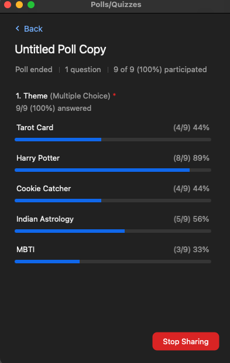
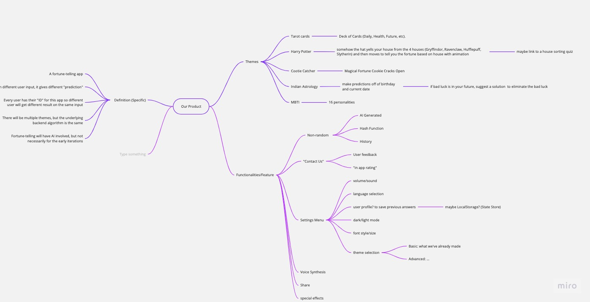

# 04-30-22 Brainstorm Meeting Title 

## Attendance

In-person:

- [ ] . . . 

Virtual:

- [X] Edwin Pham 
- [X] Frank Li 
- [X] Grace Yang 
- [X] Helena Hundhausen 
- [X] Kiyoshi Guo 
- [X] Leica Shen
- [X] Pascal Huang 
- [X] Nathaniel Greenburg 
- [X] Shreya Gupta 
- [X] William Heng 

--- 

### Agenda
#### New Business
- Brainstorm on mirco about the application's themes 

#### Old Business
- n/a

--- 

## Notes

### Brainstorm Summary 
In this brainstorm meeting, our team analyzed different themes for the application and the functionality of each theme. 

### Completed Tasks
- [X] First brainstorm on **mirco** 

### Tasks To Be completed 
- [ ] Creating application's functionality based on the theme selected

---

### Upcoming Deadlines
#### May 3rd, 2023
- Brainstorming Activity

---

### Decisions Made
1. First Theme Selected (Harry Potter)

---

## Misc / Q&As
- . . .  

--- 
## Media 
 

