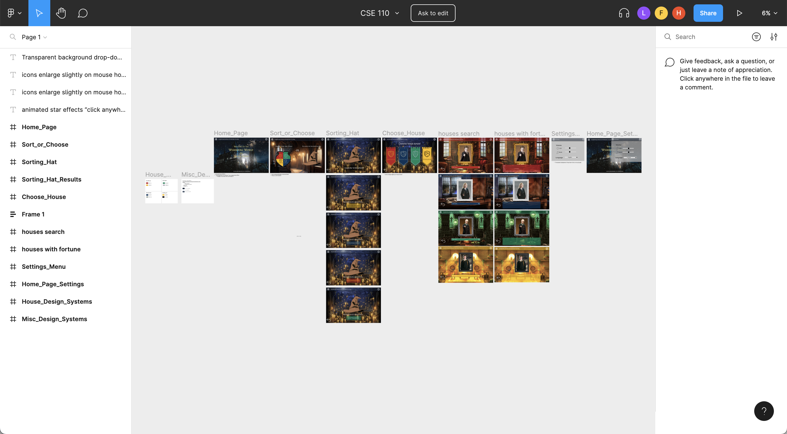

# Sprint 1 Review Meeting 

## Attendance

In-person:

- [x] Frank Li 
- [x] Grace Yang 
- [x] Helena Hundhausen 
- [x] Kiyoshi Guo 
- [x] Leica Shen
- [x] Nathaniel Greenburg 
- [x] William Heng 

Virtual:

- [x] Edwin Pham 
- [x] Shreya Gupta 
- [ ] Pascal Huang 

--- 

## Objectives

### Objective Statements

- "show and tell" what has been accomplished 
- go over work accomplishment and not to criticize or correct the Agile process 
- plan for retrospective activity/meeting for process review and improvement 

### Agenda
#### New Business
- Everyone share/tell/demo what they have done in this sprint
- Discuss/Assign tasks that need to be done for the next sprint
- Plan for next sprint meeting time
- Plan for the retrospective meeting 

--- 

## Notes

### Completed Tasks
- CI/CD Pipeline by Github Actions 
  - [documentation of the CI/CD pipeline](./../cipipeline/phase1.md)
  - We used github actions to allow our continuous integration/continuous deployment process. Our CI/CD pipeline currently has 5 main functions: 
    1. Pull Request Title Style Enforcement, 
       - Using `Commitlint` to enforce Conventional PR title style for our project's version control system
    2. Linting and Code Style Enforcement, 
        - Using `eslint` and `prettier` for enforcing code style 
    3. Code Quality via Human Review, 
        - Ensure there is no error that is not captured by the unit test 
    4. Unit Tests via Automation, 
        - Automatically test our code to make sure no errors 
    5. Documentation Generation via Automation. 
        - Document our code on a github page so that it is easier for others to understand 
- Designs of our Project
  - 
  Our design team used figma to design each page of our Fortune Telling app. The color themes, settings menu, background and layout of each page, and the navigation, etc. are all included. This makes the requirement for the implementation clear, which makes the implementation process smoother for the dev team. 
- Implementations of our Project 
  - By following the design on figma that is designed by our design team, our dev team have already implemented the following pages at this sprint: 
  - Home Page
  
  - Sort or Choose Page
  
  - Fortune Telling page for each house, each page has corresponding color theme and corresponding character in *Harry Potter* Movie of the house
  
  
  
  

---

### Upcoming Deadlines
- 5/29 deployed version of the application
- 5/30 Team Status Video 

---

### Decisions Made
1. Have retrospective meeting to review our process and discuss improvement that could be made after a lunch break  
2. Working on navigations between pages during next sprint
