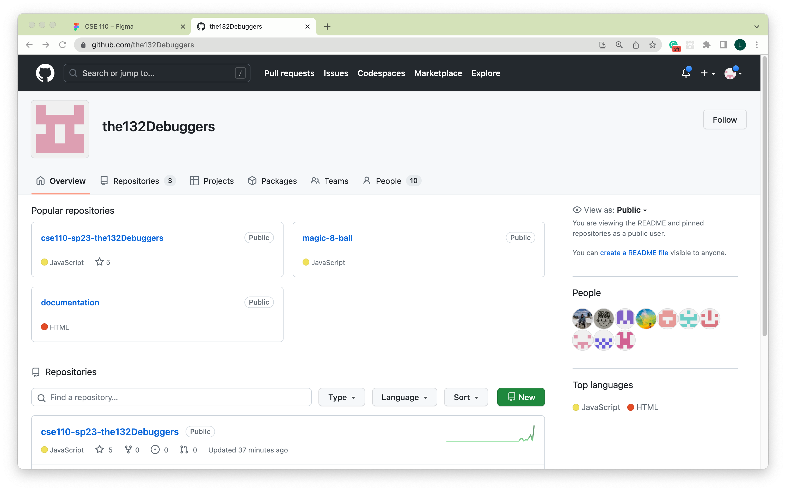
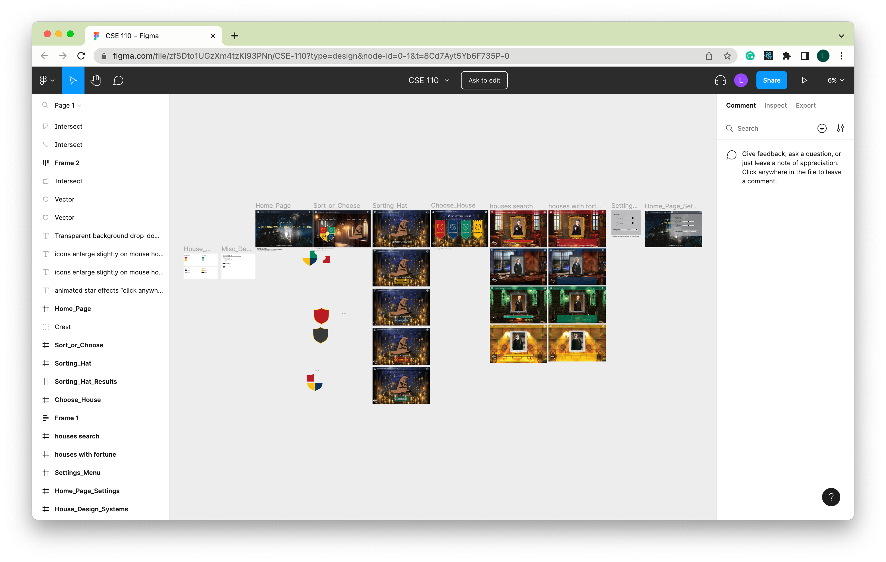

# Onboarding Documentation for the132Debuggers (Team 9)

## Introduction 
### Project Overview
Our project is a **Harry Potter** themed **fortune-telling** application. It can provide user the exact experience whether they are a fan or simply seek answers that might align with their personality. 

There are four Hogwarts Houses in our app: Gryffindor, Slytherin, Ravenclaw, Hufflepuff. User can select their house or be randomly assigned to a house, and the answer to their fortune-telling question will be based on the corresponding theme of each house. 
- For example, if the user is a Gryffindor (a house known for having people who are brave and noble) the app may predict that they go on some sort of adventure, become a marine--tasks that require bravery or being noble.

The apps list of answers are targeted towards yes and no questions. 

### Target User

- Harry Potter obsessed fans that want their fortunes read to them.
- Random people who want a fortune-telling app other than the traditional magic 8 ball

### Stakeholders 
Professor Powell and our TA Gagan are the key stakeholders involved in this project. They have a vested interest in our project's success and can provide guidance, evaluation, feedback, and support throughout the development process. 

## Technical Stack
### Technologies and Programming Languages
We are using JavaScript, HTML, and CSS for implementing this project project. JavaScript is the primary programming language used for implementing this project. We also leverage the Shadow DOM feature in JavaScript to encapsulate and isolate the components of our application, providing improved modularity and preventing CSS and JavaScript conflicts. 

### Version Control
We are using [Github](https://github.com/the132Debuggers/cse110-sp23-the132Debuggers) as our version control system. `cse110-sp23-the132Debuggers` repository is the source of our project, `documentation` repository stores the documentation of our code in its deployed [github page](https://the132debuggers.github.io/documentation/index.html). 

Detail of requirements could be found in [Codebase and Version Control](#codebase-and-version-control) section. 

### API
We are using `openai` [api](../api/index.js) to generate the answer for users' fortune-telling questions. 

## Architecture and Design
We first used [miro](https://miro.com/app/board/uXjVMN1wrD4=/) to brainstormed what theme our app should have and which features are the most important ones to have. 

We have both design team and dev team in our team. The design team used [figma](https://www.figma.com/file/zfSDto1UGzXm4tzKI93PNn/CSE-110?type=design) to design details of each page of our app and the navigation between them. Furthermore, we also have the [wireframes](/specs/interface/wireframes) of the design stored in our repo under[specs/interface/](/specs/interface/). 

### Components
Since we used shadow DOM feature in JavaScript for implementation, our app has reusable components stored in [source/components](/source/components) like headers, buttons, and pages. We also have useful global functions stored in [source/js](/source/js) directory including the navigation between each page components. 

## Development Environment Setup
There is no specific IDEs or tools for our project, but we are using `prettier` and `eslint` to enforcing code style and quality, `jest` for performing tests, and `jsdocs` for documentation generation. You can simply run `npm install` to install the necessary packages to run the necessary scripts for the project. 

## Codebase and Version Control
### Branching, Merging, Code Review, and Pull Request Process 
The `main` branch is never a place we want to `push` directly, and it is thereby _protected_. If you try to push to the `main`, the push will prompt an error. Please checkout to your own branch that has name in `type/your-github-id/description` format in order to contribute.

There is no restriction on commit messages, that being said, your commits on your branch will be squashed to one commit with the pull request (PR) title as the commit message. In order to make sure we have a linear, simple-to-track commit history, the repository has employed checks for PR titles. The PR titles have to follow [this convention](https://www.conventionalcommits.org/en/v1.0.0/#summary). Each PR should also include a informative description by appropriately fill the PR template for easier tracking progress. 

After making a Pull Request, at least one approving review by other team member is required to merge it to the main branch. 

## Development Practices
### Coding Style
We are following the [eslint code style rules](https://eslint.org/docs/latest/contribute/code-conventions), and we are using `prettier` and `eslint` to enforce and check the code style. 

Locally in editor, you should run `npm run fix` before committing any js code file. This is the same as `npm run prettier --write . && eslint --fix .` and will automatically fix the code style of the `.js` files. 

### Testing 
While our current testing coverage is limited, we have a strong intention to enhance it by incorporating both unit tests and end-to-end tests. These testing strategies are a priority for us, and we are still actively working towards their implementation.

### CI/CD 
We have our [CI/CD documentation](/admin/cipipeline/phase1.md) which documented the CI/CD pipeline in Github Action that is currently in use in our repo. We basically the following implemented in [Github Action](/.github/workflows/common.yaml): 
- code style check
- pr title style check
- documentation generation vis automation 
- testing via automation
- code quality via human review

## Documentation and Collaboration 
### Architectural Decision Records 
We have documented every architectural decisions in the [/specs/adrs](/specs/adrs) directory. 

### Documentation of Code
The documentation of our js files are stored in the deployed github page of another repo in team's github organization that can be access from [here](https://the132debuggers.github.io/documentation/index.html).

### Slack 
We use [**slack**](https://join.slack.com/t/cse110-teamworkspace/shared_invite/zt-1x9x8y75u-opR39bf6r5l20xELgdwt0Q) as our main communication tool. According to the [When2Meet](https://www.when2meet.com/?19737234-M27n2) we filled at the beginning of the quarter, we also have our routine meeting at 1-4 pm on Saturday or 2-4 pm on Sunday every week. The meeting minutes could be found in [/admin/meetings](/admin/meetings) directory. 

### Team
This is the team page for [the132Debuggers](/admin/team.md). You can get to know each team member from there. 